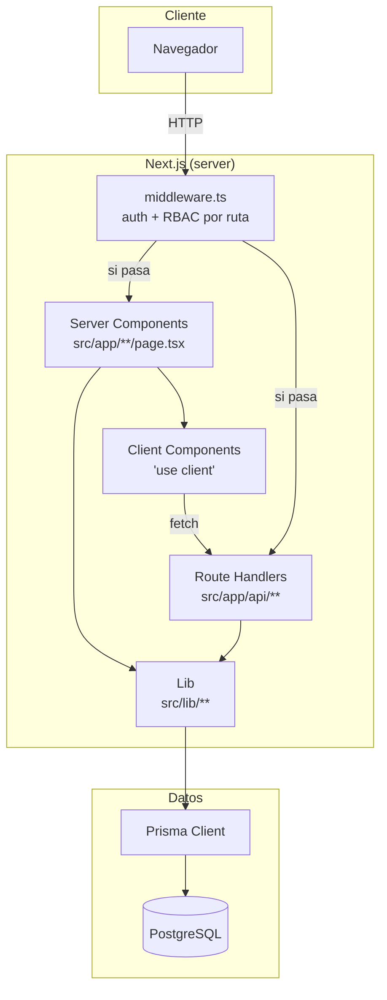
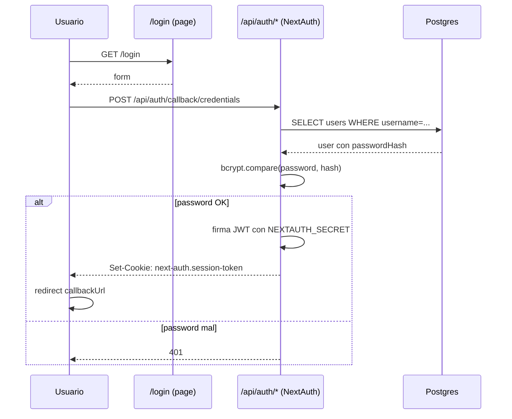
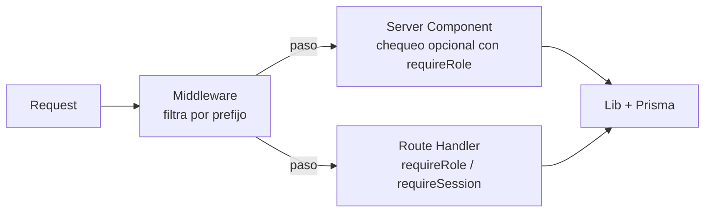
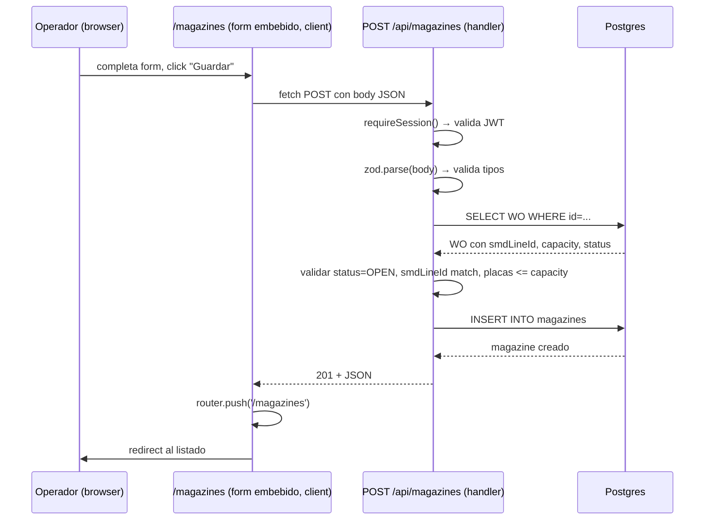

# Arquitectura

Cómo está armado SIA por dentro.

## Stack y por qué cada pieza

| Pieza | Para qué |
|---|---|
| **Next.js 15 (App Router)** | UI + routing + server components + route handlers (API REST). Permite renderizado server-side con queries directas a la DB sin BFF separado. |
| **TypeScript** | Tipado estático en todo el proyecto. Catch de errores antes de runtime. |
| **Tailwind 3** | CSS utility-first, evita CSS modules y archivos separados. |
| **Prisma 5** | ORM tipado. Genera tipos TS automáticamente del schema. |
| **PostgreSQL 16** | DB relacional. Soporta enums, JSON, FK con cascade. |
| **NextAuth 4** | Autenticación con strategy JWT. Sesiones largas (1 año), sin refresh tokens. |
| **Recharts** | Gráficos del dashboard. |
| **bcryptjs** | Hash de passwords. |
| **Zod** | Validación de inputs en API routes. |
| **Vitest** | Tests unitarios. |

## Diagrama de capas



**Reglas que se siguen**:

- **Server components** consultan datos directo (Prisma) y los pasan a client components vía props.
- **Client components** no llaman a Prisma. Si necesitan datos, los reciben por props o hacen `fetch` a una route handler.
- **Route handlers** (`/api/*`) son la API REST: `GET`, `POST`, `PATCH`, `DELETE`.
- **Lib** (`src/lib/`) contiene helpers reusables. Los puros (sin deps de DB ni auth) tienen tests.

## Flujo de autenticación



**Detalles**:

- Strategy: **JWT** (no DB sessions).
- `maxAge`: 1 año, `updateAge`: 1 año (sesión efectivamente perpetua hasta logout manual).
- Cuando el usuario hace una request, el middleware extrae el JWT del cookie y lo decodifica con `NEXTAUTH_SECRET`.
- Cambiar el secret invalida todas las sesiones activas.

## Flujo de RBAC

Tres capas chequean permisos:



### 1. Middleware (`src/middleware.ts`)

Corre antes que cualquier ruta. Filtros:

- **`/login`, `/api/auth/*`** → libres (sin auth).
- Sin token → redirige a `/login` (o 401 si es `/api/*`).
- **`/admin/*`, `/api/admin/*`** + rol ≠ ADMIN → redirige a `/` (o 403 si es API).
- **`/work-orders`** + rol = OPERADOR → redirige a `/magazines` (los OPERADOR no entran a WOs).

### 2. Server components

Las páginas pueden chequear roles antes de renderizar usando `requireSession()` o `requireRole(...)`:

```tsx
export default async function Page() {
  const session = await requireRole("ADMIN", "SUPERVISOR");
  // ...
}
```

Si el rol no aplica, `requireRole` tira un `Response` que Next interpreta como 403.

### 3. Route handlers

Cada handler valida con `requireSession()` o `requireRole(...)` al inicio. Si no, 401/403.

```ts
export async function POST(req: NextRequest) {
  const session = await requireRole("ADMIN", "SUPERVISOR");
  // ...
}
```

### Resumen de permisos por feature

| Feature | OPERADOR | SUPERVISOR | MANTENIMIENTO | PROGRAMACION | ADMIN |
|---|---|---|---|---|---|
| Cargar magazine | ✓ | ✓ | — | — | ✓ |
| Editar/borrar magazine | — | editar | — | — | borrar |
| Crear WO | — | ✓ | — | — | ✓ |
| Cerrar WO | — | ✓ | — | — | ✓ |
| Borrar WO (sin magazines) | — | — | — | — | ✓ |
| Cargar defectivo | ✓ | ✓ | — | — | ✓ |
| Iniciar parada | ✓ | ✓ | ✓ | ✓ | ✓ |
| Finalizar parada | ✓ | ✓ | ✓ | ✓ | ✓ |
| Validar/rechazar parada | — | si es intervinente | si es intervinente | si es intervinente | siempre (override) |
| Borrar parada | — | — | — | — | ✓ |
| Ver dashboard | — | — | — | — | ✓ |
| Gestión usuarios | — | — | — | — | ✓ |
| Gestión catálogos (estaciones, fallas) | — | — | — | — | ✓ |

## Flujo end-to-end: crear un magazine



**Validaciones que hace la API**:

1. Sesión válida.
2. Schema de Zod (campos requeridos y tipos).
3. WO existe.
4. WO está OPEN.
5. `smdLineId` del magazine coincide con el de la WO.
6. `placasCount` no excede `magazineCapacity` de la WO.

Cualquier falla → respuesta con `{ error: "..." }` y status code apropiado (400 / 404 / 409 / 500).

## Estructura de archivos por feature

Cada feature sigue un patrón:

```
src/app/(app)/<feature>/
├── page.tsx              # server component: query + render
├── client.tsx            # client component: form + interacción
├── filters.tsx           # filtros de listado (opcional)
└── new/
    ├── page.tsx          # form de creación
    └── form.tsx          # client form

src/app/api/<feature>/
├── route.ts              # GET (lista) + POST (crear)
└── [id]/
    ├── route.ts          # PATCH + DELETE
    ├── end/route.ts      # acciones específicas
    └── validate/route.ts
```

## Server vs Client Components

### Server (default)

- `async function Page() { ... }`.
- Pueden hacer `await prisma.X.findMany()`.
- No pueden usar `useState`, `useEffect`, `onClick`.
- Se renderizan en el servidor; el HTML llega al cliente.

### Client

- Empiezan con `"use client";` arriba.
- Pueden usar hooks de React.
- No pueden importar Prisma directamente — tienen que llamar a route handlers.

### Cómo se combinan

Patrón típico: el server component hace la query y le pasa los datos al client component como prop:

```tsx
// page.tsx (server)
export default async function MagazinesPage() {
  const rows = await prisma.magazine.findMany({...});
  const lines = await prisma.smdLine.findMany();
  return <MagazinesClient rows={rows} lines={lines} />;
}

// client.tsx (client)
"use client";
export function MagazinesClient({ rows, lines }) {
  const [filter, setFilter] = useState("");
  // interacción y filtrado en el cliente
}
```

## Manejo de errores

### En route handlers

```ts
try {
  // ...
} catch (e: unknown) {
  const msg = e instanceof Error ? e.message : "Error";
  return NextResponse.json({ error: msg }, { status: 500 });
}
```

### En server components

`requireSession()` y `requireRole()` tiran un `Response` que Next maneja como 401/403. Errores de Prisma se propagan a la página de error de Next.

### En client components

`fetch` y luego:

```ts
if (!res.ok) {
  const data = await res.json().catch(() => ({}));
  setError(typeof data.error === "string" ? data.error : "Error");
  return;
}
```

## Decisiones de diseño

### Por qué JWT y no DB sessions

- Más simple: no hay tabla `sessions`.
- Suficiente para uso on-prem en una planta.
- Trade-off: invalidar una sesión específica no es trivial (rotás `NEXTAUTH_SECRET` y caen todas).

### Por qué `db push` y no `migrate`

- Iteración rápida en early-stage.
- Las migraciones formales agregan fricción que no se justifica todavía.
- Trade-off: hay que tener cuidado al cambiar schema con datos.

### Por qué Server Components con Prisma directo

- Menos código.
- Menos round-trips.
- Trade-off: no se puede "cachear" como una API REST tradicional, y secrets de DB tienen que estar en el server.

### Por qué `(app)` y `admin/` separados

- `(app)` agrupa rutas autenticadas con layout común.
- `admin/` se filtra por middleware (`role !== "ADMIN" → redirect`). Más simple que checks por página.

### Por qué `permissions.ts` separado de `rbac.ts`

- `rbac.ts` importa `next-auth` y `@/lib/auth` (que importa Prisma).
- `permissions.ts` no importa nada → testeable sin bootstrappear DB.
- `rbac.ts` re-exporta lo que necesitan los demás archivos.

## Lo que NO está

- **Realtime**: no hay WebSockets ni Server-Sent Events. El dashboard se refresca con F5.
- **Notificaciones push**: no hay. Si querés que mantenimiento se entere de paradas pendientes, tienen que entrar a ver.
- **Audit log centralizado**: cada modelo tiene `createdAt` / `updatedAt` y FKs a quién hizo qué (createdBy, validatedBy, interventionUser), pero no hay una tabla `audit_events`.
- **Multi-tenancy**: una sola planta por instancia. Si hace falta multi-planta, sería un cambio grande.
- **Tests E2E**: hay solo unit tests de helpers puros. Ver [testing.md](testing.md).

## Próximos pasos

- [Modelo de datos](modelo-datos.md) — cada tabla en detalle.
- [Testing](testing.md) — qué se testea y cómo.
- [Contribuir](contribuir.md) — convenciones del repo.
