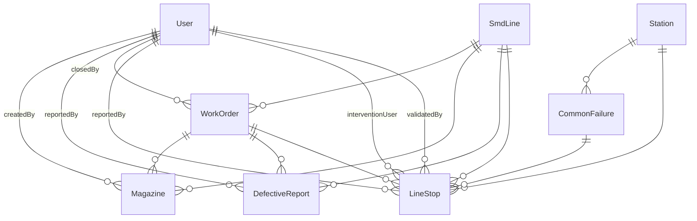

# Modelo de datos

Qué representa cada tabla en el dominio de la planta y cómo se relacionan.

> Fuente de verdad: [`prisma/schema.prisma`](../../prisma/schema.prisma). Esto explica el **por qué** de cada cosa.

## Diagrama ER simplificado



## Enums

### `Role`

Roles del sistema. Append-only en Postgres (agregar valores no rompe datos).

```
ADMIN | SUPERVISOR | OPERADOR | MANTENIMIENTO | PROGRAMACION
```

Ver [glosario → roles](../glosario.md#roles-y-permisos) para qué hace cada uno.

### `Shift`

Bloque horario de trabajo. Solo dos:

```
MORNING (06:00–14:59) | AFTERNOON (resto)
```

La detección automática vive en `src/lib/shift.ts`. Los formularios precargan el turno actual pero permiten override.

### `WOStatus`

Estado de una Work Order:

```
OPEN | CLOSED
```

Mientras `OPEN`, se le pueden cargar magazines, defectivos y paradas. Cuando pasa a `CLOSED`, queda solo-lectura. No hay re-apertura desde la UI (requiere SQL manual).

### `LineStopStatus`

Estado de una parada de línea:

```
PENDING | VALIDATED | REJECTED
```

Las recién creadas son `PENDING`. Cuando el intervinente designado (o admin) las revisa, pasa a `VALIDATED` o `REJECTED`. `REJECTED` requiere un comentario obligatorio.

## Modelos

### `User`

Cuenta humana. Un único registro por persona, identificada por `username`.

| Campo | Por qué |
|---|---|
| `username` | Login. Único, regex `[a-zA-Z0-9._-]`, 3–32 chars. |
| `passwordHash` | Hash bcrypt (cost 10). Nunca se guarda la pass plana. |
| `fullName` | Lo que aparece en columnas de auditoría y header. |
| `role` | Determina qué puede hacer. Ver enum `Role`. |
| `active` | Soft-delete. Inactivos no pueden loguear ni aparecen en desplegables. |
| `createdAt` / `updatedAt` | Auditoría básica. |

**Relaciones inversas**: cada vez que un usuario carga algo (magazine, defectivo, parada) o cierra algo (WO, parada validada), queda asociado.

### `SmdLine`

Línea de producción (SMD1..SMD8). Catálogo casi inmutable — pre-cargado por el seed, raramente se agregan más.

| Campo | Por qué |
|---|---|
| `name` | Identificador legible. Único. |
| `active` | Si una línea sale de servicio, la desactivás (no se borra para preservar histórico). |

**Relaciones**: hace de "padre" para WorkOrders, Magazines, DefectiveReports y LineStops.

### `WorkOrder`

Orden de trabajo de producción. Define qué se va a fabricar, cuánto y en qué línea.

| Campo | Por qué |
|---|---|
| `woNumber` | Identificador del negocio (de planificación). Único en todo el sistema. |
| `productCode` | Modelo / código de producto (ej. `TKLE3214D`). |
| `totalQty` | Objetivo total **en placas**. Se compara contra producido (paneles × troquel) para % de avance. |
| `dailyTargetQty` | Cantidad diaria estimada **en placas**. Default 0. Usado en el dashboard para calcular cumplimiento del día. Si es 0, no se reportan métricas diarias para esta WO. |
| `magazineCapacity` | Cuántos **paneles** entran en un magazine. 17 / 25 / 50 (validado por zod). Solo editable mientras la WO no tenga magazines cargados. |
| `troquel` | Cuántas **placas** se obtienen de cada panel. Multiplicador para convertir paneles a placas. Solo editable mientras la WO no tenga magazines cargados. Default 1 (para WOs migradas). |
| `smdLineId` | Línea asignada. Una WO pertenece a **una sola línea**. |
| `status` | OPEN o CLOSED. |
| `openedAt` | Cuándo se creó. Default `now()`. |
| `closedAt` / `closedById` | Cuándo y quién cerró. Null si está abierta. |

**Reglas**:

- `magazineCapacity` y `troquel` solo se pueden cambiar si la WO no tiene magazines cargados.
- Solo se puede borrar si tiene 0 magazines asociados.
- Una línea puede tener varias WOs abiertas a la vez (se desaconseja pero está permitido).

### `Magazine`

Bandeja de paneles que sale cerrada de la línea. Es el evento productivo principal.

| Campo | Por qué |
|---|---|
| `magazineCode` | Código físico del magazine (ej. `MG-001`). No es único globalmente — el mismo código se reutiliza entre WOs. |
| `workOrderId` | A qué WO pertenece. La WO define la capacidad, la línea y el troquel. |
| `smdLineId` | En qué línea se produjo. **Tiene que coincidir con la línea de la WO** (validado en API). |
| `placasCount` | Cuántos **paneles** entraron en este magazine. ≤ `workOrder.magazineCapacity`. El nombre del campo es histórico (antes representaba placas). |
| `shift` | Mañana o Tarde. Editable en el form. |
| `createdById` | Operador que cargó el registro. |
| `createdAt` | Cuándo se cerró el magazine. Default `now()`. |

**Reglas**:

- No se puede crear contra una WO cerrada o ya completada al 100% (validación en API).
- `placasCount` (paneles) ≤ `magazineCapacity`.
- `smdLineId` debe coincidir con `workOrder.smdLineId`.
- ON DELETE de WO es `Restrict` — no se puede borrar la WO si hay magazines.
- Las placas producidas por un magazine = `placasCount` × `workOrder.troquel`.

### `DefectiveReport`

Reporte de placas defectuosas al cierre del turno. **Modelo actual: contador único, sin destino.**

| Campo | Por qué |
|---|---|
| `reportDate` | Fecha del reporte (sin hora). Útil para agrupar por día. |
| `shift` | Turno al que pertenece. |
| `smdLineId` | Línea donde ocurrieron. |
| `workOrderId` | WO contra la que se imputan. |
| `defectiveQty` | Cantidad total de placas defectuosas en ese turno + línea + WO. |
| `reportedById` | Quién cargó el reporte. |
| `createdAt` | Timestamp del registro. |

**Por evolucionar**: la planta distingue **Validación / Reparación / Scrap** como destinos distintos. Se conversó en el changelog y va a llegar como una migración futura. Hoy todo entra como `defectiveQty` bruto.

### `Station`

Estación física dentro de una línea (loader, printer, cm602-1, etc.). Catálogo administrable.

| Campo | Por qué |
|---|---|
| `name` | Identificador único, en minúsculas y con guiones (`cm602-1`). |
| `active` | Soft-delete. Las inactivas no aparecen en formularios de paradas. |

**Relaciones**: cada parada referencia una estación. Cada estación tiene su catálogo de fallas comunes.

**Reglas**: borrar solo si `lineStops` count = 0; en otro caso, desactivar.

### `CommonFailure`

Falla típica catalogada para una estación específica. Es el desplegable que ve el operador al iniciar una parada.

| Campo | Por qué |
|---|---|
| `stationId` | A qué estación pertenece. |
| `label` | Descripción legible. Único por estación (`@@unique([stationId, label])`). |
| `active` | Soft-delete. |
| `createdAt` | Auditoría. |

**Relaciones**: las paradas pueden referenciar una falla común (`commonFailureId`) o tener texto libre (`customFailure`), o ambas. ON DELETE de Station es `Cascade` — si se borra la estación, las fallas asociadas se borran (pero antes se chequea que no haya paradas usándolas, así que en la práctica nunca llega).

### `LineStop`

Evento de parada de línea. El modelo más rico del sistema.

| Campo | Por qué |
|---|---|
| `smdLineId` | Línea donde ocurrió. Required. |
| `workOrderId` | WO activa al momento de la parada. **Nullable**: si la línea no tiene WO abierta, queda en null. Auto-vinculación si hay exactamente una WO abierta. |
| `shift` | Turno autocomputado de `startedAt`. |
| `startedAt` | Cuándo arrancó la parada. Default `now()` al hacer POST. |
| `endedAt` | Cuándo terminó. Null mientras la parada esté activa. |
| `code` | Código 1..18 del catálogo BSIA F.20. **Nullable** — el form actual ya no lo pide pero queda por si se reactiva. |
| `stationId` | Estación afectada. Required. |
| `commonFailureId` | Falla del catálogo, si se eligió una. |
| `customFailure` | Texto libre, si la falla no estaba catalogada. Pueden coexistir. |
| `comment` | Detalle adicional opcional. |
| `status` | PENDING / VALIDATED / REJECTED. |
| `reportedById` | Quién creó el registro. |
| `interventionRole` / `interventionUserId` | Rol y usuario que intervino en la solución. Se setean al **finalizar** la parada. Determinan quién puede validarla después. |
| `validatedById` / `validatedAt` / `validatedComment` | Datos del validador (puede ser el intervinente o un admin como override). |
| `createdAt` / `updatedAt` | Auditoría. |

**Reglas que la API enforza**:

- Al **iniciar**: `station.active === true`. Si se mandó `commonFailureId`, debe pertenecer a esa estación.
- Al **finalizar**: `interventionRole` debe coincidir con el `role` real del `interventionUserId`. El usuario debe estar `active`. `endedAt >= startedAt`.
- Al **validar**: `endedAt != null`. Solo el intervinente designado o un ADMIN pueden hacerlo. `REJECTED` requiere `comment` no vacío.

## Índices

Los `@@index` declarados en el schema cubren las queries más frecuentes:

| Índice | Por qué |
|---|---|
| `WorkOrder.status` | Listar abiertas vs cerradas. |
| `WorkOrder.openedAt` | Orden cronológico en listados. |
| `WorkOrder.smdLineId` | Filtrar WOs por línea (en form de magazines). |
| `Magazine.workOrderId` | Sumar producido por WO. |
| `Magazine.smdLineId` | Filtrar por línea. |
| `Magazine.createdAt` | Orden cronológico. |
| `Magazine.createdById` | Auditar quién cargó. |
| `LineStop.smdLineId` / `startedAt` / `status` / `shift` / `workOrderId` / `interventionUserId` | Filtros del listado de paradas y consultas por intervinente. |
| `DefectiveReport.reportDate` / `smdLineId` / `workOrderId` | Agregaciones del dashboard. |

## Reglas de borrado (ON DELETE)

| Relación | Comportamiento | Razón |
|---|---|---|
| `Magazine.workOrder` | `Restrict` | No se puede borrar una WO con magazines. Hay que cerrarla. |
| `Station → CommonFailure` | `Cascade` | Borrar estación borra sus fallas (pero la API previa chequea que no haya paradas que las usen). |
| Todo lo demás | Default (`Restrict`) | Las FKs sin onDelete explícito no permiten borrar el padre si hay hijos. |

En la práctica, **todo se desactiva, nada se borra** salvo:

- WOs sin magazines.
- Estaciones sin paradas.
- Fallas sin paradas.
- Paradas (solo admin las borra).

## Cómo evolucionar el modelo

Ver [troubleshooting → schema y migraciones](../deploy/troubleshooting.md#schema-y-migraciones) para el patrón "agregar un NOT NULL sin perder datos".

Reglas rápidas:

- **Agregar enum value**: append-only en Postgres, `db push` lo aplica solo. Sin pérdida de datos.
- **Agregar campo nullable**: trivial. `db push` lo aplica.
- **Agregar campo NOT NULL con default**: trivial. Las filas existentes toman el default.
- **Agregar campo NOT NULL sin default**: peligroso. Si hay datos, hacer en 3 pasos (nullable → backfill → not null).
- **Renombrar campo**: hacer add + backfill + drop en migraciones separadas. Con `db push` directo perdés datos.
- **Cambiar el tipo de un campo**: depende, suele requerir SQL custom. Mejor un `prisma migrate` real.
