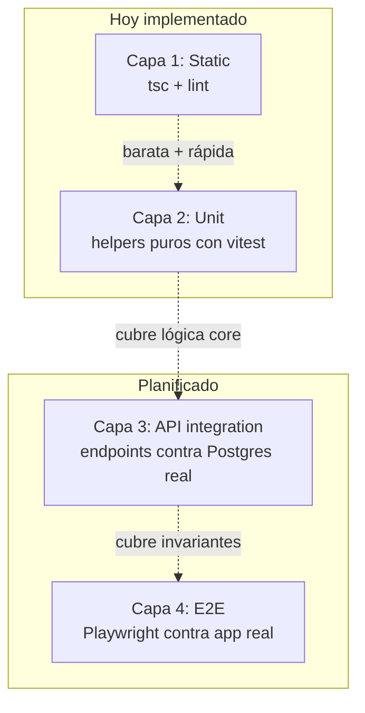

# Testing

Qué se testea, qué no, y cómo agregar nuevos tests.

## Filosofía

- **Testeamos comportamiento, no implementación**. Los tests sobreviven refactors.
- **Tests donde está el riesgo real**: invariantes de dominio, RBAC, cálculos puros, validaciones de API.
- **No 100% coverage**. Coverage es métrica, no objetivo. Apuntamos a cubrir lo que duele cuando se rompe.

## Capas de testing



### Capa 1 — Static (`tsc` + lint)

**Qué cubre**: errores de tipos, imports rotos, código muerto detectable estáticamente.

**Cuándo corre**: en cada save (extensión TS del editor), pre-commit (recomendado), CI obligatorio.

**Cómo correr local**:

```bash
npm run typecheck   # tsc --noEmit, ~5s
npm run lint        # next lint
```

**Falla en CI** si:
- Hay errores de tipos.
- Hay errores de lint.

### Capa 2 — Unit tests (Vitest)

**Qué cubre**: helpers puros en `src/lib/`. Funciones sin side effects, sin DB, sin auth.

**Hoy hay 48 tests sobre**:

| Archivo | Tests | Cubre |
|---|---|---|
| `src/lib/fpy.test.ts` | 6 | `computeFpy(placas, defectivos)` — división por cero, redondeo, negativos |
| `src/lib/cumulative.test.ts` | 5 | `cumulativeByMagazine(rows)` — multi-WO, orden, no muta input |
| `src/lib/shift.test.ts` | 8 | `defaultShiftForNow()` — bordes 06/14:59/15/23:35 |
| `src/lib/stopCodes.test.ts` | 24 | catálogo 18 códigos, `stopCodeInfo`, `categoryForCode`, `computeStopDurationSec`, `formatDurationSec` |
| `src/lib/permissions.test.ts` | 5 | `canEditMagazines`, `canValidateLineStop`, `ALL_ROLES` |

**Cómo correr local**:

```bash
npm test              # una pasada
npm run test:watch    # watch mode (recomendado mientras editás lib/)
npm run test:coverage # cobertura, solo de src/lib/
```

**Falla en CI** si algún test no pasa.

### Capa 3 — API integration (planificado)

**Qué cubriría**: route handlers de `/api/*` contra una DB Postgres real, con sesiones simuladas para cada rol.

**Tests prioritarios cuando se implemente**:

| Endpoint | Casos mínimos |
|---|---|
| `POST /api/wo` | happy + falta `smdLineId` + OPERADOR rechazado + `woNumber` duplicado + `dailyTargetQty` negativo |
| `POST /api/magazines` | happy + línea ≠ línea-de-WO + placas > capacity + WO cerrada |
| `POST /api/wo/[id]/close` | happy ADMIN/SUPERVISOR + OPERADOR rechazado + idempotencia |
| `DELETE /api/wo/[id]` | bloqueado si tiene magazines + OK si no + SUPERVISOR rechazado |
| `POST /api/line-stops/[id]/validate` | happy intervinente + happy ADMIN override + rechazado por otro usuario + REJECTED sin comentario |
| `PATCH /api/admin/users/[id]` | happy + auto-deactivate bloqueado + auto-degradación bloqueada |

**Setup necesario** (cuando se implemente):

- `docker-compose.test.yml` con Postgres dedicado.
- Fixture: usuario por rol pre-cargado.
- Helper `makeRequest({ as: "ADMIN", method, path, body })` que mockea el JWT.
- Antes de cada suite: `prisma migrate deploy` + truncate de tablas.

### Capa 4 — E2E (planificado)

**Qué cubriría**: el camino dorado a través de la UI real con Playwright.

**Tests que valen la pena**:

1. Login + nav por rol (cada rol ve los links que corresponde).
2. Flow completo: ADMIN crea WO → OPERADOR carga magazine → SUPERVISOR cierra → OPERADOR no puede cargar más.
3. Flow de paradas: OPERADOR inicia → finaliza eligiendo MANTENIMIENTO como intervinente → MANTENIMIENTO valida.
4. Defectivos: cargar y verificar que aparece en dashboard.

**Setup**: Playwright + helpers de `loginAsAdmin()` / `loginAsOperador()` + factories de WO/Magazine.

## Cómo escribir un test nuevo

### Template para tests unitarios

```ts
// src/lib/mi-helper.test.ts
import { describe, expect, it } from "vitest";
import { miHelper } from "./mi-helper";

describe("miHelper", () => {
  it("describe el comportamiento esperado en castellano", () => {
    expect(miHelper(input)).toBe(esperado);
  });

  it("maneja el caso borde X", () => {
    expect(miHelper(bordeInput)).toBe(...);
  });
});
```

### Reglas para que el test sobreviva refactors

1. **Test de comportamiento, no de implementación**: probás qué devuelve, no cómo lo hace internamente.
2. **Imports relativos** (`./mi-helper`) si está al lado. Imports con `@/` también funcionan.
3. **Sin mocks innecesarios**: si la función es pura, no mockees nada.
4. **Nombres en castellano**: `it("redondea milisegundos al segundo más cercano")`. Hace de doc viva.
5. **Casos borde primero**: 0, null, vacío, negativo, máximo.
6. **Tabla de inputs cuando aplica**: para funciones con muchos casos similares, usá un loop:
   ```ts
   for (let c = 1; c <= 12; c++) {
     expect(categoryForCode(c)).toBe("OPERATOR");
   }
   ```

### Reglas para que sea testeable

Si una función mezcla lógica con DB / auth / fetch, **separala**:

- **Antes**: función que hace todo en `route.ts`.
- **Después**:
  - `src/lib/foo.ts` — la lógica pura (testeable).
  - `route.ts` — orquesta DB + lógica + response.

Ejemplo real: el cálculo de FPY estaba inline en el dashboard. Lo extraje a `src/lib/fpy.ts` y se volvió trivial de testear.

## Configuración

### `vitest.config.ts`

```ts
import { defineConfig } from "vitest/config";
import path from "node:path";

export default defineConfig({
  resolve: {
    alias: {
      "@": path.resolve(process.cwd(), "./src"),
    },
  },
  test: {
    environment: "node",
    include: ["src/**/*.test.ts", "src/**/*.test.tsx"],
    coverage: {
      provider: "v8",
      include: ["src/lib/**/*.ts"],
      exclude: ["src/lib/db.ts", "src/lib/auth.ts", "src/lib/rbac.ts", "**/*.test.ts"],
    },
  },
});
```

**Decisiones**:

- **`environment: "node"`**: los tests son de helpers puros, no de DOM. Más rápido que jsdom.
- **Alias `@/`**: igual que el proyecto principal. Apunta a `src/`.
- **Coverage solo de `src/lib/`**: no contamos cobertura de UI ni de route handlers (eso es trabajo de capas 3 y 4).
- **Excluimos `db.ts`, `auth.ts`, `rbac.ts`**: estos archivos son adaptadores con dependencias externas, no lógica testeable unitariamente. Sus partes puras viven en `permissions.ts`.

### CI

`.github/workflows/ci.yml` corre en cada push y PR:

1. `npm ci`
2. `npx prisma generate`
3. `npx prisma validate`
4. `npm run typecheck`
5. `npm run lint`
6. `npm test`
7. `npm run build`

Si cualquiera falla, el PR no se puede mergear.

## Cuándo escribir un test

- **Bug fix**: SIEMPRE. Primero el test que reproduce el bug, después el fix. Así nunca regresa.
- **Nueva función con lógica**: al momento de escribirla. Es más barato que después.
- **Nueva función con ramas o matemática**: imperdible.
- **Función "cosmética"** (formatea, concatena strings sin condiciones): no agrega valor.

## Cuándo NO escribir tests

- Componentes React triviales (solo markup, sin lógica condicional).
- Adaptadores delgados sobre librerías externas (Prisma, NextAuth, etc.).
- Código que está por desaparecer (vamos a refactorizar la semana que viene).
- Pre-mergeable: si no estás 100% seguro de que la API es la final, escribir tests prematuros = doble trabajo.

## Cómo agregar Capa 3 cuando llegue el momento

**Mínimo necesario**:

1. Agregar a `docker-compose.yml` un perfil `test` con Postgres efímero (sin volumen).
2. Variable de entorno `TEST_DATABASE_URL`.
3. Helper `setupTestDb()` que corre `db push` + truncate antes de cada suite.
4. Helper `as(role: AppRole, fn)` que envuelve el handler con un JWT mockeado.
5. Primer test: `POST /api/wo` con los 5 casos mínimos.

Cuando estés listo para implementarlo, decime y lo armamos juntos.

## Próximos pasos

- [Contribuir](contribuir.md) — convenciones de commits y PRs.
- [Modelo de datos](modelo-datos.md) — qué representa cada tabla, base para integration tests.
